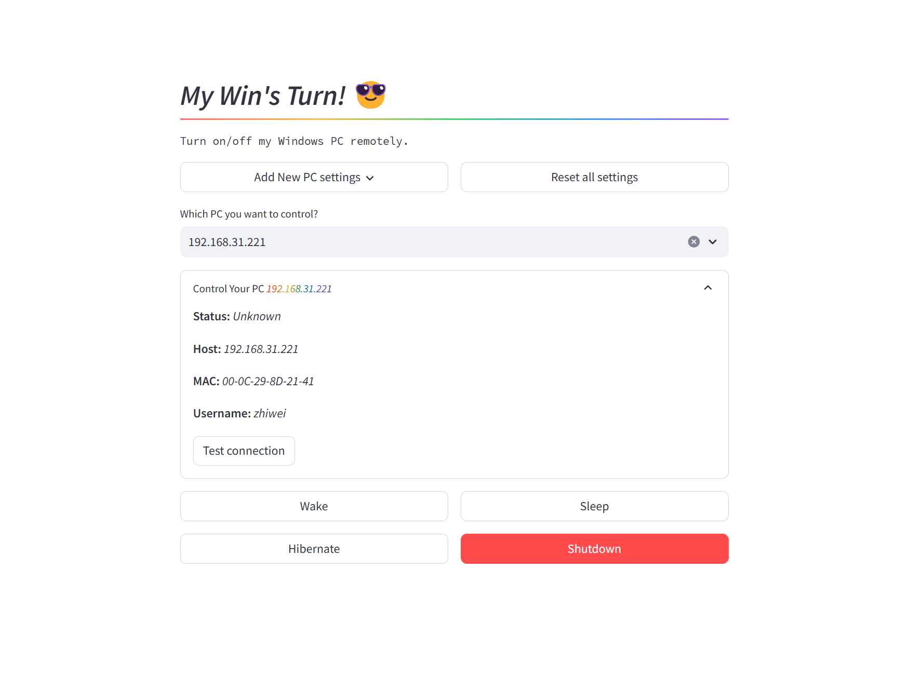

# my-wins-turn

My Win's Turn！远程控制我的 Windows PC 开关机和休眠、唤醒。



## 如何工作

- 利用 Wake-on-LAN 发送 Magic packet 数据包对 PC 进行唤醒和开机；
- 借助 OpenSSH 服务对 PC 发送关机、休眠等指令；
- 以 Docker 容器的方式部署在极空间 NAS 上，并使用极空间的“远程访问”功能来实现远程控制；

## 在 Windows PC 上安装启用 OpenSSH 服务

- [Install OpenSSH for Windows](https://learn.microsoft.com/en-us/windows-server/administration/openssh/openssh_install_firstuse?tabs=powershell#install-openssh-for-windows)

```powershell
# Install the OpenSSH Client
Add-WindowsCapability -Online -Name OpenSSH.Client~~~~0.0.1.0

# Install the OpenSSH Server
Add-WindowsCapability -Online -Name OpenSSH.Server~~~~0.0.1.0

# Start the sshd service
Start-Service sshd

# OPTIONAL but recommended:
Set-Service -Name sshd -StartupType 'Automatic'

# Confirm the Firewall rule is configured. It should be created automatically by setup. Run the following to verify
if (!(Get-NetFirewallRule -Name "OpenSSH-Server-In-TCP" -ErrorAction SilentlyContinue | Select-Object Name, Enabled)) {
    Write-Output "Firewall Rule 'OpenSSH-Server-In-TCP' does not exist, creating it..."
    New-NetFirewallRule -Name 'OpenSSH-Server-In-TCP' -DisplayName 'OpenSSH Server (sshd)' -Enabled True -Direction Inbound -Protocol TCP -Action Allow -LocalPort 22
} else {
    Write-Output "Firewall rule 'OpenSSH-Server-In-TCP' has been created and exists."
}
```
